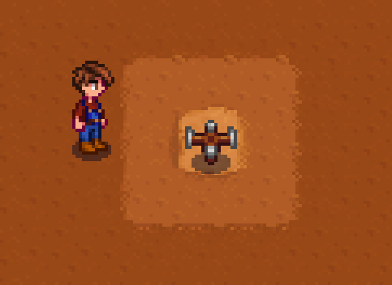
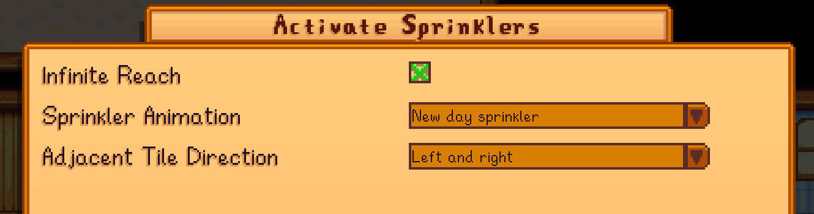

**Activate Sprinklers** is a [Stardew Valley](https://www.stardewvalley.net/) mod that lets you activate sprinklers by simply right clicking them.

## Configuration

### In-game configuration

This mod has [Generic Mod Config Menu](https://www.nexusmods.com/stardewvalley/mods/5098) support.

### `config.json`

<table>
<tr>
<th>setting</th>
<th>what it affects</th>
<th>default</th>
</tr>
<tr>
<td><code>InfiniteReach</code></td>
<td>

**(Keyboard + mouse only)**

Whether the player can activate sprinklers from any distance

</td>
<td><code>false</code></td>
</tr>
<tr>
<td><code>SprinklerAnimation</code></td>
<td>

Which animation should be used when activating a sprinkler

Possible values:

- `None`: no animation
- `NewDayAnimation`: uses the same animation as the sprinklers do when a new day starts
- `WateringCanAnimation`: uses the same animation as a watering can does

</td>
<td><code>WateringCanAnimation</code></td>
</tr>
<tr>
<td><code>AdjacentTileDirection</code></td>
<td>

**(Controller only)**

While holding the action button, side adjacent tiles can be searched for sprinklers and then activated as usual 

Possible values:

- `None`: don't search side adjacent tiles for sprinklers
- `Left`: only the left side adjacent tile is searched
- `Right`: only the right side adjacent tile is searched
- `LeftRight`: both left and right side adjacent tiles are searched

</td>
<td><code>LeftRight</code></td>
</tr>
</table>

## See also

- [Nexus mods](https://www.nexusmods.com/stardewvalley/mods/2088)
- [Release notes](release-notes.md)