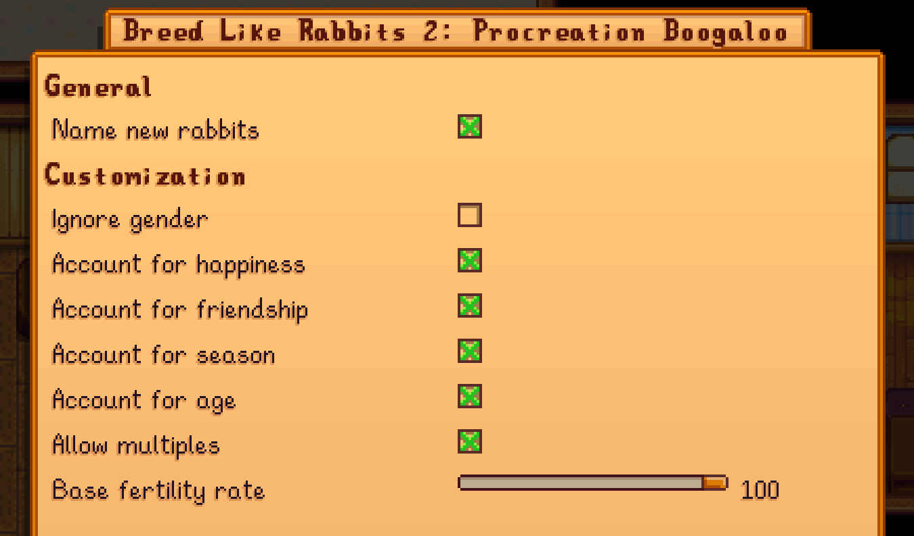

**Breed Like Rabbits 2** is a [Stardew Valley](https://www.stardewvalley.net/) mod that makes rabbits be able to breed.

## Configuration

### In-game configuration

This mod has [Generic Mod Config Menu](https://www.nexusmods.com/stardewvalley/mods/5098) support.

### `config.json`

<table>
<tr>
<th>setting</th>
<th>what it affects</th>
<th>default value</th>
</tr>
<tr>
<td><code>NameNewRabbits</code></td>
<td>

Whether to name each and every new rabbit after they are born

If `false`, a random name using the game's own random name generation will be used instead 

</td>
<td><code>true</code></td>
</tr>
<tr>
<td><code>IgnoreGender</code></td>
<td>Whether to ignore gender of the rabbit(s) in calculations.</td>
<td><code>false</code></td>
</tr>
<tr>
<td><code>AccountForHappiness</code></td>
<td>Whether to include fertility bonus based on the rabbit's happiness</td>
<td><code>true</code></td>
</tr>
<tr>
<td><code>AccountForFriendship</code></td>
<td>Whether to include fertility bonus based on the rabbit's friendship with the player</td>
<td><code>true</code></td>
</tr>
<tr>
<td><code>AccountForSeason</code></td>
<td>Whether to include fertility bonus or penalty based on the current season</td>
<td><code>true</code></td>
</tr>
<tr>
<td><code>AccountForAge</code></td>
<td>Whether to include fertility bonus or penalty based on the rabbit's age</td>
<td><code>true</code></td>
</tr>
<tr>
<td><code>AllowMultiples</code></td>
<td>Whether to allow multiple offspring at once. The size is determined by fertility</td>
<td><code>true</code></td>
</tr>
<tr>
<td><code>BaseRate</code></td>
<td>

Base fertility rate before bonuses. 

A value of 42 means an average of 42 days between births before fertility bonuses and penalties are taken into account.

</td>
<td><code>42</code></td>
</tr>
</table>

## See also

- [Nexus mods](https://www.nexusmods.com/stardewvalley/mods/3429)
- [Release notes](release-notes.md)