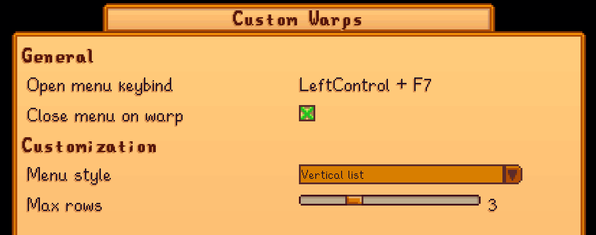

**Custom Warps** is a [Stardew Valley](https://www.stardewvalley.net/) mod that allows you to create custom warp points and teleport to them at will.

## Configuration

### In-game configuration

This mod has [Generic Mod Config Menu](https://www.nexusmods.com/stardewvalley/mods/5098) support.

### `config.json`

<table>
<tr>
<th>setting</th>
<th>what it affects</th>
<th>default value</th>
</tr>
<tr>
<td><code>ToggleKey</code></td>
<td>Which keybind to use to open the custom warp menu</td>
<td><code>"F7"</code></td>
</tr>
<tr>
<td><code>CloseMenuOnWarp</code></td>
<td>Whether to close the warp menu after a warp</td>
<td><code>true</code></td>
</tr>
<tr>
<td><code>MenuStyle</code></td>
<td>

Which menu style to use. 

Possible options:

- `LegacyGrid`: the old grid-like menu
- `VerticalList`: the new (and hopefully improved) menu; allows sorting by warp name and date

</td>
<td><code>VerticalList</code></td>
</tr>
<tr>
<td><code>MaxGridColumns</code></td>
<td>

**(`LegacyGrid` menu style only)**

How many columns should be visible in the grid view (at maximum).

Allows values from the range:

`1 <= value <= 8`

</td>
<td><code>3</code></td>
</tr>
</table>

## See also

- [Nexus mods](https://www.nexusmods.com/stardewvalley/mods/3445)
- [Release notes](release-notes.md)