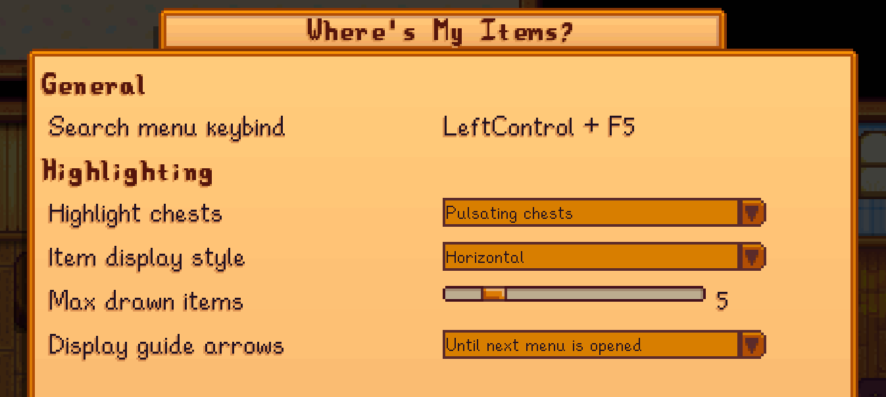

**Where's My Items** is a [Stardew Valley](https://www.stardewvalley.net/) mod that helps you find items from search based on a text input.

## Configuration

### In-game configuration

This mod has [Generic Mod Config Menu](https://www.nexusmods.com/stardewvalley/mods/5098) support.

### `config.json`

<table>
<tr>
<td>setting</td>
<td>what it affects</td>
<td>default value</td>
</tr>
<tr>
<td><code>ToggleButton</code></td>
<td>Which keybind to use to open the item search menu</td>
<td><code>"F5"</code></td>
</tr>
<tr>
<td><code>ChestHighlightMethod</code></td>
<td>

Which chest highlighting style to use. 

Possible options:

- `None`: no chest highlighting
- `TypingRipple`: a small ripple effect on each chest with every key press (excluding `Esc`)
- `PulsatingChest`: highlights the chest based on the value(s) of a sine wave

</td>
<td><code>TypingRipple</code></td>
</tr>
<tr>
<td><code>ItemDisplayStyle</code></td>
<td>

Which item drawing style (direction) to use

Possible options:

- `None`: no drawing items over chests
- `Horizontal`: draws items horizontally
- `Vertical`: draws items vertically

</td>
<td><code>Vertical</code></td>
</tr>
<tr>
<td><code>MaxItemsDrawnOverChests</code></td>
<td>

Limits how many items can be drawn at once (per chest)

- If set to 0, no items will be drawn (equivalent to `ItemDrawDirection = None`)
- If set to -1, there is no limit to how many items can be drawn

</td>
<td><code>3</code></td>
</tr>
<tr>
<td><code>GuideArrowOption</code></td>
<td>

Whether to draw arrows around the player that guide towards chests containing items the player has searched for

Possible options:

- `None`: no guiding arrows
- `WhileMenuOpen`: guiding arrows are displayed only while the item search menu is open
- `UntilNextMenu`: guiding arrows are displayed until any menu gets opened

</td>
<td><code>WhileMenuOpen</code></td>
</tr>
</table>

## TODO

- More searching options, e.g.:
  - start with `@` to search for quantities,
  - start with `#` to search for category names, 
  - etc.?

## See also

- [Nexus mods](https://www.nexusmods.com/stardewvalley/mods/2086)
- [Release notes](release-notes.md)